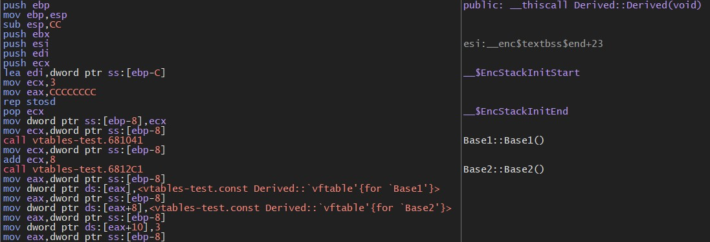
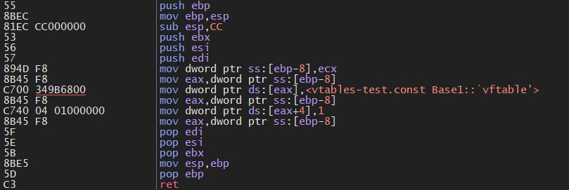
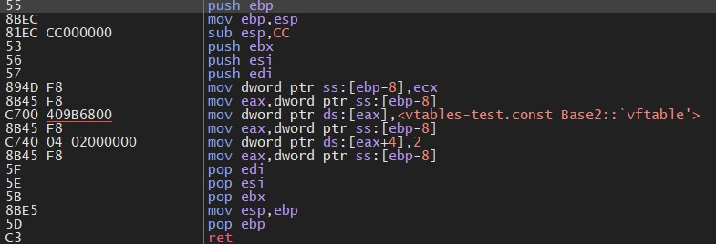

# **Virtual Method Tables - Guide**

- [ ] MSVC implementation
    - [x] for C++20
    - [ ] for C++17
    - [ ] for C++14
    - [ ] for C++11
- [ ] GCC implementation
- [ ] Clang implementation

# MSVC compiler

## 1. C++20 (/std:c++20)
1. ``Base <-- Derived``
with ``virtual test()`` method;

2. ``(Base1, Base2) <-- Derived``
with ``virtual test()`` method in both classes ``Base1``, ``Base2``. Overrided in ``Derived`` class;

3. ``(Base1, Base2)`` <-- ``Derived``
with virtual methods in ``Base1``, ``Base1``, and new virtual method in ``Derived`` (only in ``Derived meta()``),
so MSVC construct vtable of ``Derived`` as (vtable(Base1) + vtable(Derived)). Concat this two tables in beginning of the ``Derived`` class;
``Base2`` has own offset and own vtable, with ``test()`` implementation in it, without ``meta()`` method
from ``Derived`` class. 

Below is ``Derived::Derived`` constructor:\

Below is ``Base1::Base1`` constructor:\

Below is ``Base2::Base2`` constructor:\

---
**Resources**:
1. MSVC Run-Time Checks (RTC): https://learn.microsoft.com/en-us/cpp/build/reference/rtc-run-time-error-checks?view=msvc-170